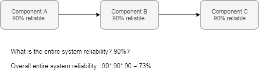
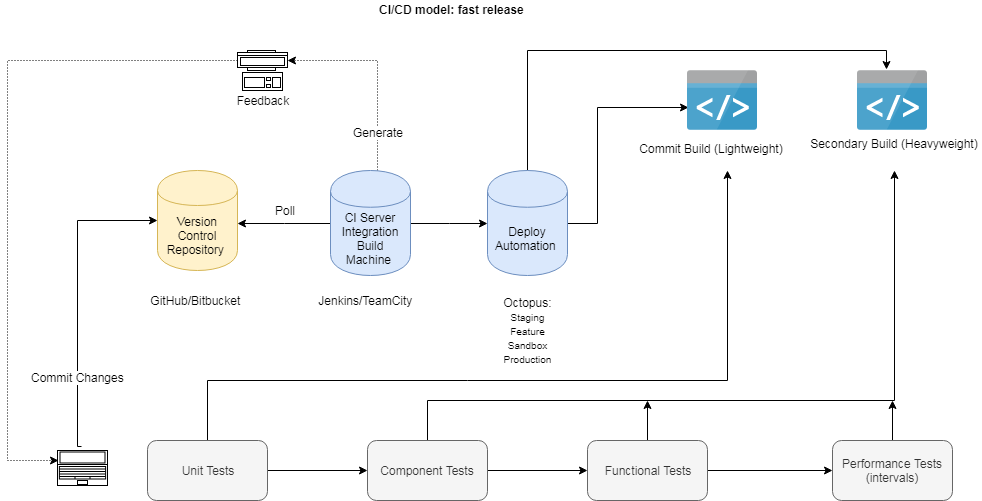
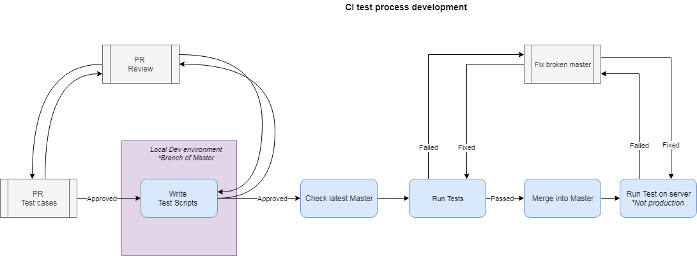
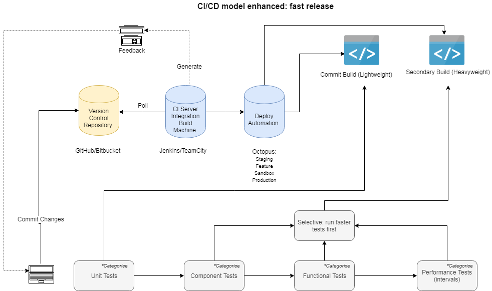

---
## CI and CD pipeline
### API based application testings
---
### Where do we start? 
---
### Setup goals:
1. Dedicated SDET in CI place
2. All product teams on board with CI processes
3. Team ownership not individuals 
4. Repeatable and disposable framework
5. Quality in every stage of the pipeline
---
#### Test Scenario: reliability

1. A system with 100 components each having 99% reliability, would yield 37% reliable
2. Would you release?  
---
### How do we ensure 100% reliability? 
---
1. 100% SLA (or close), ensure reliability at the lowest level
2. If cannot ensure and measure reliability at lowest level, cannot possible do that at system level 
3. Unit Testing?
---

---
How to develop test process? 
---

---
### Enhancements? 
1. Tests part of architectural components
2. Test Categorisation and structure specially codebase increases 
---

---
..* Selecting tools
..* Given is API based application 
1. Postman 
2. Rest-Assured 
3. Golang
4. Gatling
---
#?
